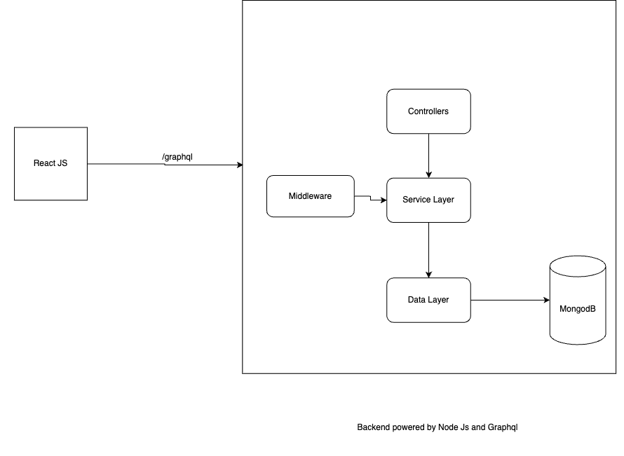
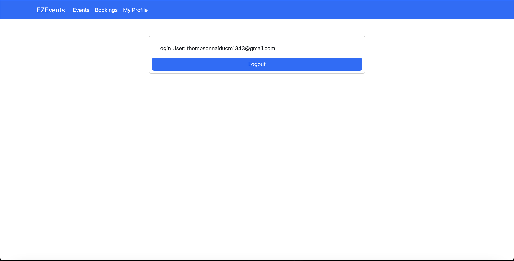
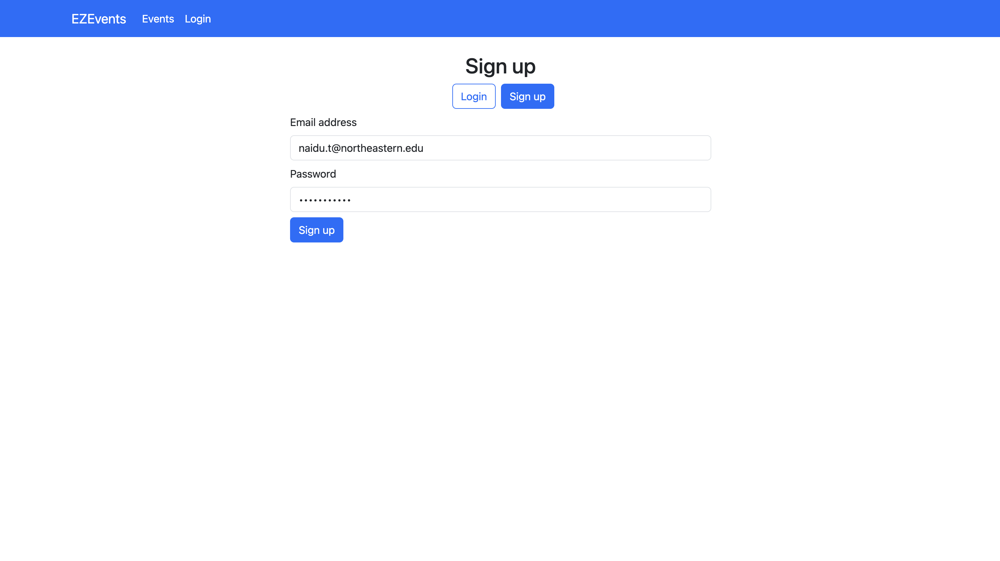
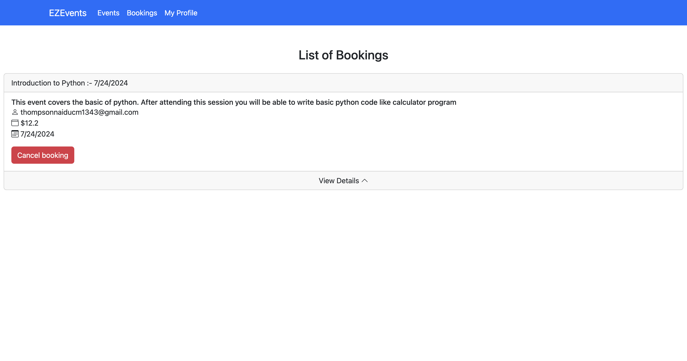
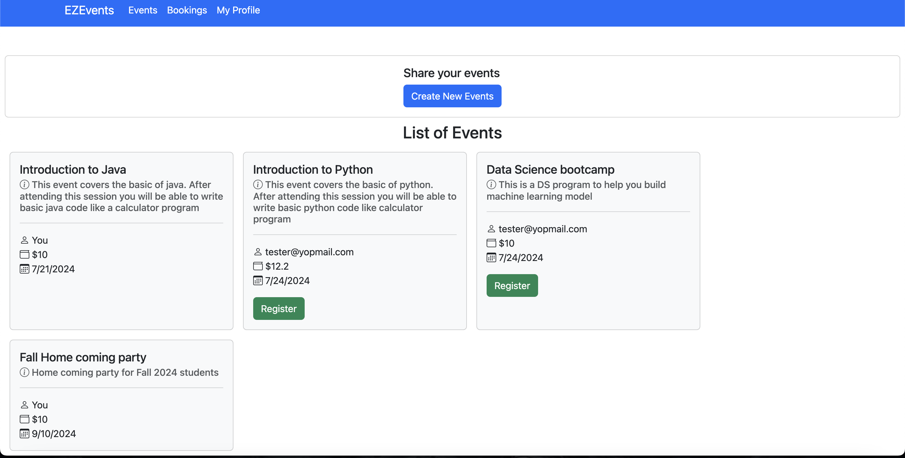
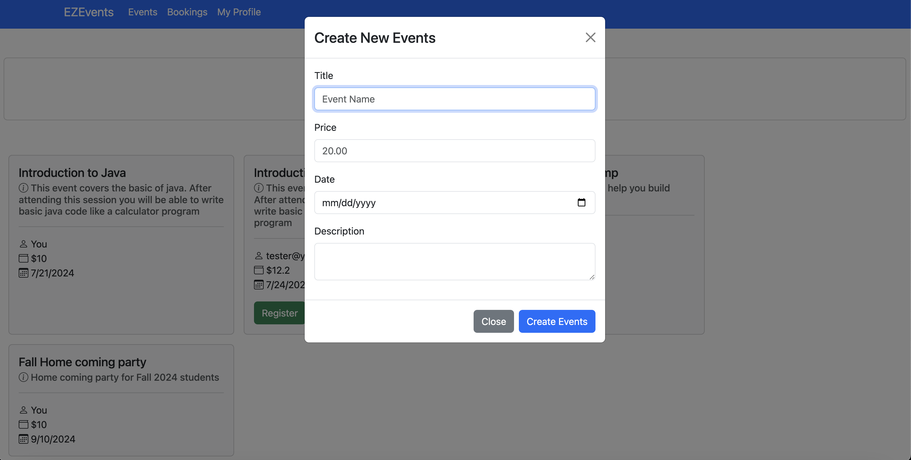

# EZ EVENT
EZEvent is an event booking application designed to allow users to create, register for, and cancel event bookings. This mini-project demonstrates the integration of modern web technologies, including React for the frontend, MongoDB for the database, and Node.js with Express.js for the backend. The application utilizes **GraphQL** to manage data interactions, providing a practical example of how to implement and leverage **GraphQL** in a real-world application. The primary goal of EZEvent is to offer hands-on experience with **GraphQL** and build a fully functional event management system.

## High Level Design

## Technologies Used:

- React JS
- JWT
- Graphql
- Apollo Client
- Mongo DB
- Mongooes
- Bootstrap
- Node JS
- Nodemon

## React Application Screenshot

- Profile Screen

- Sign Up

  

- List and cancel user booking

 

- List all events

 

- Create new Events

  
